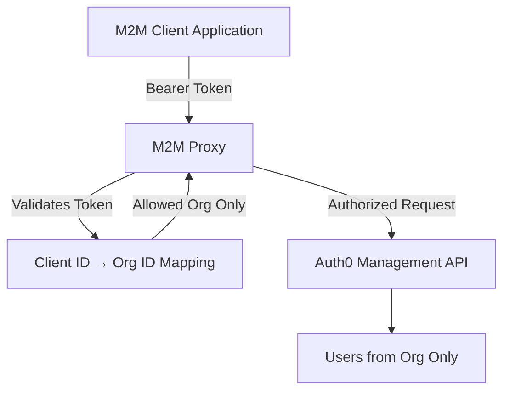

# Auth0 M2M Proxy

**PROOF OF CONCEPT**: It's simple, but might need some more work to be production-grade. 

Basically the issue is that when you create an Machine to Machine (M2M) token for the management API, it's always scoped to the entire tenant. There's no way to reduce it's scope to just a certain organisation (confirmed with auth0 support). If you, for example, have an edge-deployed server (or deployed on someone else's premesis) and you need to sync your users DB with Auth0, the management token you need has access to read _all_ the users, instead of just the ones that belong to the organisation your backend should use.

This resolves the issue by creating a lightweight, secure proxy service that restricts m2m clients to access only the users within their associated Auth0 **Organization**, using the Auth0 Management API. You deploy the proxy in a place where you control, and then point your edge deployments to the proxy instead of going directly to Auth0.

---

## Features

- Validates Auth0-issued M2M tokens
- Enforces per-client organization access
- Forwards allowed requests to Auth0 Management API
- Blocks cross-org user access
- Dockerized with uv

---

## Still To Do

- [ ] Logging
- [ ] Add unit tests for token validation (e2e tests really)
- [ ] Make more transparent instead of proxying just /users. Could just be an invisible proxy

## Architecture



---

## Configuration

Create a `config.json` file at the root of the project:

```json
{
  "clients": {
    "YOUR_CLIENT_ID": "org_abc123",
    "ANOTHER_CLIENT_ID": "org_xyz456"
  },
  "auth0": {
    "domain": "your-tenant.auth0.com",
    "mgmt_client_id": "MGMT_CLIENT_ID",
    "mgmt_client_secret": "MGMT_CLIENT_SECRET",
    "management_audience": "https://your-tenant.auth0.com/api/v2/",
    "api_audience": "whatever (best to make it the url of this API when deployed)"
  }
}
````

---

## Running the Proxy

### 1. Install dependencies

```bash
pip install -r requirements.txt
```

### 2. Start the server locally

```bash
uvicorn main:app --host 0.0.0.0 --port 8000
```

Or run with Docker:

```bash
docker build -t auth0-proxy .
docker run -p 8000:8000 -v $(pwd)/config.json:/app/config.json auth0-proxy
```

---

## API Usage

prereq: get the token for auth0. Will look something like this:

```
curl --request POST \
  --url https://ethonai-prod.eu.auth0.com/oauth/token \
  --header 'content-type: application/json' \
  --data '{
    "client_id":"ID of m2m client",
    "client_secret":"secret of the m2m client",
    "audience":"audience of the api server",
    "grant_type":"client_credentials"
    "organization": "org you set up in auth0"
  }'
```

### `GET /users`

Returns users **only** from the organization associated with the caller’s client ID.

**Headers:**

```http
Authorization: Bearer <M2M token from Auth0>
```

**Response:**

```json
[
  {
    "user_id": "auth0|abc...",
    "email": "user@example.com",
    ...
  }
]
```

