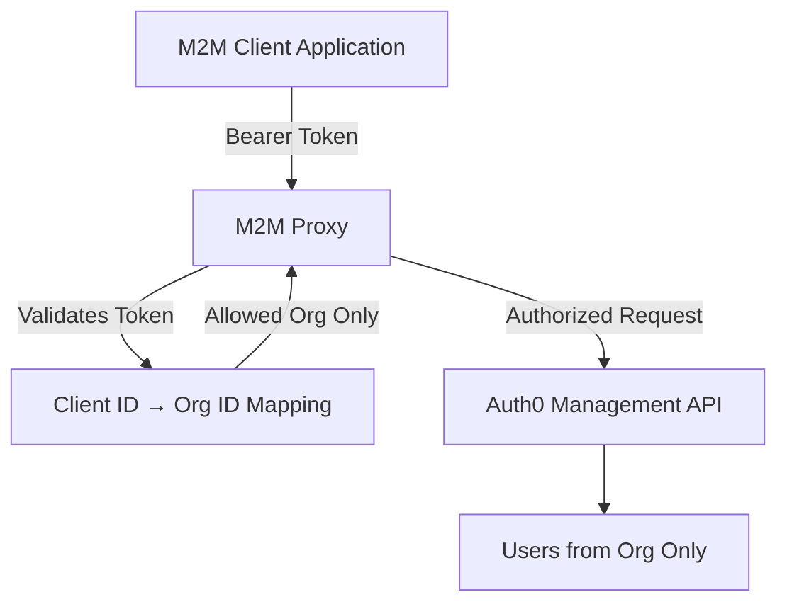

# Auth0 M2M Proxy

A lightweight, secure proxy service that restricts Auth0 Machine-to-Machine (M2M) clients to access only the users within their associated Auth0 **Organization**, using the Auth0 Management API.

This resolves the issue of tenant-wide M2M tokens by enforcing per-organization access control at the proxy level.

---

## Features

- Validates Auth0-issued M2M tokens
- Enforces per-client organization access
- Forwards allowed requests to Auth0 Management API
- Blocks cross-org user access
- Dockerized and easy to deploy

---

## Architecture



---

## Configuration

Create a `config.json` file at the root of the project:

```json
{
  "clients": {
    "YOUR_CLIENT_ID": "org_abc123",
    "ANOTHER_CLIENT_ID": "org_xyz456"
  },
  "auth0": {
    "domain": "your-tenant.auth0.com",
    "mgmt_client_id": "MGMT_CLIENT_ID",
    "mgmt_client_secret": "MGMT_CLIENT_SECRET",
    "audience": "https://your-tenant.auth0.com/api/v2/"
  }
}
````

---

## Running the Proxy

### 1. Install dependencies

```bash
pip install -r requirements.txt
```

### 2. Start the server locally

```bash
uvicorn main:app --host 0.0.0.0 --port 8000
```

Or run with Docker:

```bash
docker build -t auth0-proxy .
docker run -p 8000:8000 -v $(pwd)/config.json:/app/config.json auth0-proxy
```

---

## API Usage

### `GET /users`

Returns users **only** from the organization associated with the caller’s client ID.

**Headers:**

```http
Authorization: Bearer <M2M token from Auth0>
```

**Response:**

```json
[
  {
    "user_id": "auth0|abc...",
    "email": "user@example.com",
    ...
  }
]
```

